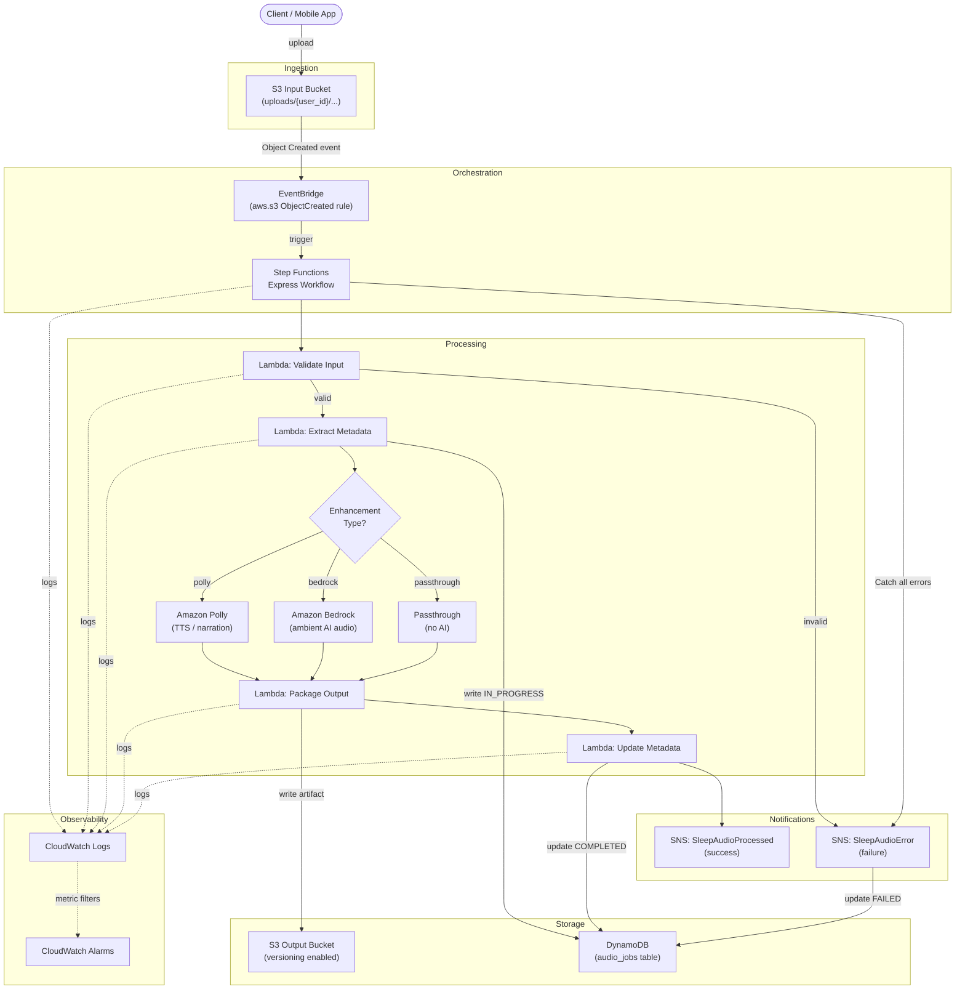
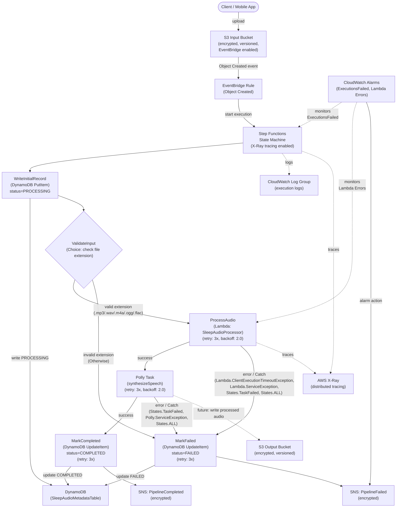
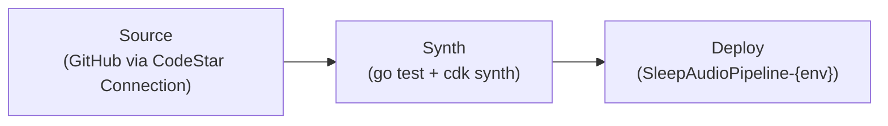
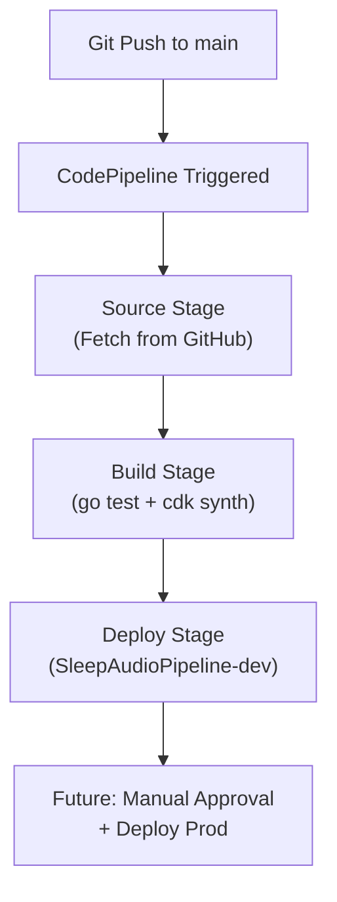

# Architecture

> This document is the **source of truth** for the Event-Driven Sleep Audio Pipeline design.
> All infrastructure changes must be reflected here before (or alongside) implementation.

---

## Table of Contents

1. [High-Level Overview](#high-level-overview)
2. [Data Flow](#data-flow)
3. [System Diagram](#system-diagram)
4. [AWS Services and Rationale](#aws-services-and-rationale)
5. [Security Design](#security-design)
6. [Observability](#observability)
7. [Multi-Environment Support](#multi-environment-support)
8. [Cost Considerations](#cost-considerations)
9. [Future Extensibility](#future-extensibility)

---

## High-Level Overview

The **Event-Driven Sleep Audio Pipeline** is a serverless AWS-native system that accepts raw audio uploads from users (voice recordings, ambient sounds, guided meditations) and transforms them into polished sleep audio artifacts. The pipeline is fully event-driven: no polling, no always-on compute, and no manual orchestration.

The pipeline proceeds through four logical phases:

| Phase | Description |
|---|---|
| **Ingestion** | User uploads a raw audio file to the S3 input bucket. |
| **Orchestration** | EventBridge detects the upload and triggers a Step Functions state machine. |
| **Processing** | The state machine coordinates validation, AI enhancement (Polly / Bedrock), and metadata extraction. |
| **Delivery** | Processed audio is saved to the S3 output bucket; metadata lands in DynamoDB; SNS emits a completion or failure notification. |

All infrastructure is defined as AWS CDK constructs in Go, deployed across `dev`, `stage`, and `prod` environments through CDK context values.

---

## Data Flow

### Ingestion

1. A client (mobile app, web frontend, or direct SDK call) uploads a raw audio file to the **S3 Input Bucket** under a key pattern such as `uploads/{user_id}/{timestamp}/{filename}`.
2. S3 emits an `Object Created` event to **Amazon EventBridge** when EventBridge notifications are enabled on the bucket.
### Orchestration

3. An **EventBridge Rule** matches the `aws.s3` source and `Object Created` detail type, filtering by the `uploads/` key prefix. On match, it invokes an **AWS Step Functions** Express Workflow as the target.

### Processing

The Step Functions state machine executes the following states in sequence:

4. **Validate Input** - A Lambda task reads the object headers via S3 `HeadObject` and confirms the file type (e.g., `.mp3`, `.wav`, `.m4a`) and size are within acceptable bounds. On failure, it transitions directly to the Error Notification state.
5. **Extract Metadata** - A Lambda task parses `user_id` (and other identifiers) from the S3 key and reads object headers via S3 `HeadObject` (e.g., size, content-type, user-defined metadata). If audio properties such as duration/bit rate are required, it runs an audio probe step (e.g., ffprobe/mediainfo) and then writes an initial record to **DynamoDB** with `processing_status = IN_PROGRESS`.
6. **AI Enhancement (Choice)** - A Choice state inspects the job configuration embedded in the EventBridge event payload:
   - If `enhancement_type = polly`, invoke **Amazon Polly** to synthesise a soothing narration layer or convert a text script to speech.
   - If `enhancement_type = bedrock`, invoke **Amazon Bedrock** (e.g., `amazon.titan-tts-v1` or a compatible audio model) to generate ambient sleep sounds or blend audio layers using AI.
   - If `enhancement_type = passthrough`, skip AI processing and proceed directly to packaging.
7. **Package Output** - A Lambda task merges the original audio with any AI-generated layer, applies normalisation, and writes the final artifact to the **S3 Output Bucket** under `processed/{user_id}/{job_id}/{filename}`.
8. **Update Metadata** - A Lambda task updates the DynamoDB record with `processing_status = COMPLETED`, the output S3 key, duration, and a processing timestamp.

### Delivery

9. On successful completion, the state machine publishes a **success notification** to an **SNS Topic** (e.g., `SleepAudioProcessed`).
10. On any unhandled error, the state machine's Catch block publishes a **failure notification** to the same or a separate **SNS Error Topic** and updates DynamoDB with `processing_status = FAILED`.
11. Downstream consumers (push notification services, analytics, data lakes) subscribe to the SNS topic via SQS fan-out or direct Lambda triggers.

---

## System Diagram



---

## Implemented Components (Current State)

The following components are deployed in the current CDK stack:

| Component | Status | Configuration |
|---|---|---|
| **S3 Input Bucket** | Deployed | Encryption: S3-managed (AES256), versioning enabled, block public access (all four settings), EventBridge notifications enabled, removal policy: DESTROY |
| **S3 Output Bucket** | Deployed | Encryption: S3-managed (AES256), versioning enabled, block public access (all four settings), removal policy: DESTROY |
| **EventBridge Rule** | Deployed | Matches `Object Created` events from `aws.s3` source filtered by input bucket name; targets the Step Functions state machine |
| **Step Functions State Machine** | Deployed | Chain: PutItem (DynamoDB) -> ValidateInput (Choice: file extension) -> [valid] ProcessAudio (Lambda, retry: 3x) -> Polly synthesizeSpeech (retry: 3x) -> UpdateItem (COMPLETED) -> SNS Completed; [invalid/error] -> UpdateItem (FAILED) -> SNS Failed; logging at ALL level with execution data; X-Ray tracing enabled; specific error type Catch blocks on ProcessAudio (Lambda.ClientExecutionTimeoutException, Lambda.ServiceException, Lambda.AWSLambdaException, Lambda.SdkClientException, States.TaskFailed) and PollyTask (States.TaskFailed, Polly.ServiceException); States.ALL fallback Catch on both |
| **DynamoDB Table (SleepAudioMetadataTable)** | Deployed | Partition key: `audioId` (S), on-demand billing (PAY_PER_REQUEST), AWS-managed encryption (SSE), point-in-time recovery enabled, removal policy: DESTROY |
| **CloudWatch Log Group** | Deployed | Destination for state machine execution logs; removal policy: DESTROY |
| **SNS Topic (Completed)** | Deployed | Topic name: SleepAudioPipelineCompleted, encrypted with AWS-managed SNS KMS key (alias/aws/sns) |
| **SNS Topic (Failed)** | Deployed | Topic name: SleepAudioPipelineFailed, encrypted with AWS-managed SNS KMS key (alias/aws/sns) |
| **Lambda (SleepAudioProcessor)** | Deployed | Runtime: provided.al2023 (Go custom runtime), handler: bootstrap, wired to Lambda runtime API via `lambda.Start(handler)`, validates required fields and file extension, environment: TABLE_NAME + OUTPUT_BUCKET_NAME, IAM: DynamoDB read/write on metadata table, X-Ray tracing: ACTIVE, structured JSON logging |

### Metadata Layer

The **SleepAudioMetadataTable** (DynamoDB) provides durable metadata tracking for every audio processing job in the pipeline. Each record is keyed by `audioId` (the S3 object key) and stores:

- `status` - Current processing state: `PROCESSING`, `COMPLETED`, or `FAILED`
- `bucket` - Source S3 bucket name
- `objectKey` - Source S3 object key
- `createdAt` - Timestamp when processing started
- `updatedAt` - Timestamp of the last status update

The table uses on-demand billing (PAY_PER_REQUEST) to handle variable workloads without capacity planning. Server-side encryption (AWS-managed) protects data at rest, and point-in-time recovery enables restoration to any second within the last 35 days.

### Orchestration Layer

The Step Functions state machine (`SleepAudioPipelineStateMachine`) serves as the orchestration backbone for the audio processing pipeline. It chains primary tasks with input validation, error handling, and notifications:

1. **WriteInitialRecord** (DynamoDB PutItem) - Creates an initial metadata record with `status=PROCESSING`, capturing the audio ID, source bucket, object key, and creation timestamp from the EventBridge event payload. Uses a ConditionExpression to prevent overwriting in-flight records.
2. **ValidateInput** (Choice) - Inspects the file extension from `$.detail.object.key` using `StringMatches` conditions. Valid extensions: `*.mp3`, `*.wav`, `*.m4a`, `*.ogg`, `*.flac`. If the extension matches any valid pattern, execution proceeds to ProcessAudio. If no pattern matches (the `Otherwise` branch), execution routes directly to MarkFailed, rejecting unsupported file types before any processing occurs.
3. **ProcessAudio** (LambdaInvoke) - Invokes the SleepAudioProcessor Lambda function to perform audio processing/validation. The Lambda receives a flattened payload (`{audioId, bucket, objectKey}`) extracted from the EventBridge envelope. This task has a Catch clause for error handling.
4. **PollyTask** (CallAwsService) - Calls Amazon Polly's `synthesizeSpeech` API to generate audio content (voice: Joanna, format: mp3). This task has a Catch clause for error handling.
5. **MarkCompleted** (DynamoDB UpdateItem) - Updates the metadata record to `status=COMPLETED` with an `updatedAt` timestamp on successful execution.
6. **NotifyCompleted** (SNS Publish) - Publishes a success notification to the `SleepAudioPipelineCompleted` SNS topic with the audio ID and status.

**Error Handling:** If the ProcessAudio Lambda or Polly task fails (any error), the Catch clause transitions execution to the **MarkFailed** state (DynamoDB UpdateItem), which sets `status=FAILED` and records the `updatedAt` timestamp. If the ValidateInput Choice state determines the file extension is invalid, it also routes directly to MarkFailed. After marking the failure, execution proceeds to **NotifyFailed** (SNS Publish), which publishes a failure notification to the `SleepAudioPipelineFailed` SNS topic with the audio ID, status, and error details. This ensures the metadata table always reflects the true state of each job and downstream consumers are notified of both outcomes.

Both MarkCompleted/MarkFailed and NotifyCompleted/NotifyFailed have built-in retry policies (3 attempts with exponential backoff). NotifyCompleted and NotifyFailed also have Catch clauses with fallback Pass states so that SNS delivery failure does not prevent the state machine from completing.

#### Error Handling Strategy

The pipeline implements a layered error handling strategy with specific error type matching and automatic retries:

**Specific Error Types Caught:**

| Task | Specific Errors | Fallback |
|---|---|---|
| **ProcessAudio** | `Lambda.ClientExecutionTimeoutException`, `Lambda.ServiceException`, `Lambda.AWSLambdaException`, `Lambda.SdkClientException`, `States.TaskFailed` | `States.ALL` |
| **PollyTask** | `States.TaskFailed`, `Polly.ServiceException` | `States.ALL` |

**Catch Block Pattern:** Each processing task defines specific error catches first, followed by a `States.ALL` fallback. This allows the state machine to handle known transient errors differently from unexpected failures while ensuring no error goes unhandled. All Catch blocks route to the `MarkFailed` state, storing error details in `$.error`.

**Retry Policies:**

All tasks in the state machine have retry policies configured for automatic recovery from transient failures:

| Task | Errors Retried | Interval | Max Attempts | Backoff Rate |
|---|---|---|---|---|
| **ProcessAudio** | `Lambda.ClientExecutionTimeoutException`, `Lambda.ServiceException`, `Lambda.AWSLambdaException`, `Lambda.SdkClientException`, `States.TaskFailed` | 3s | 3 | 2.0x |
| **PollyTask** | `States.TaskFailed`, `Polly.ServiceException` | 3s | 3 | 2.0x |
| **MarkCompleted** | `States.ALL` | 2s | 3 | 2.0x |
| **MarkFailed** | `States.ALL` | 2s | 3 | 2.0x |
| **NotifyCompleted** | `States.ALL` | 2s | 3 | 2.0x |
| **NotifyFailed** | `States.ALL` | 2s | 3 | 2.0x |

**Fallback Pattern:**

1. A task encounters an error during execution.
2. The retry policy evaluates whether the error matches a retryable type. If yes, the task is retried up to the configured max attempts with exponential backoff.
3. If retries are exhausted (or the error does not match a retryable type), the Catch block evaluates the error:
   - Specific error Catch blocks fire first (e.g., `Lambda.ServiceException`).
   - If no specific Catch matches, the `States.ALL` fallback Catch fires.
4. The Catch transitions execution to `MarkFailed`, which records the failure in DynamoDB and proceeds to `NotifyFailed`.

The state machine is configured with:

- **CloudWatch Logs** at `ALL` level with execution data included, enabling full visibility into each execution.
- **X-Ray tracing** enabled for distributed tracing across service boundaries.
- **IAM policies** granting `lambda:InvokeFunction`, `polly:SynthesizeSpeech`, `dynamodb:PutItem`, `dynamodb:UpdateItem`, and `sns:Publish` permissions scoped appropriately.
- **Retry policies** on DynamoDB and SNS tasks (3 attempts with exponential backoff starting at 2 seconds).

The EventBridge rule triggers the state machine on every S3 Object Created event from the input bucket, passing the full event payload as execution input.

### Notification Layer

The pipeline uses Amazon SNS to notify downstream consumers of processing outcomes. Two encrypted topics provide distinct channels for success and failure events:

- **SleepAudioPipelineCompleted** - Receives a message when the pipeline finishes successfully, containing the audio ID and a `COMPLETED` status. Subscribers can use this to trigger delivery workflows, update UI state, or feed analytics.
- **SleepAudioPipelineFailed** - Receives a message when the pipeline encounters an error, containing the audio ID, a `FAILED` status, and error details from the Step Functions Catch clause. Subscribers can use this for alerting, retry logic, or dead-letter processing.

Both topics are encrypted at rest using the AWS-managed SNS KMS key (`alias/aws/sns`), ensuring messages are protected without requiring custom key management. The state machine role is granted `sns:Publish` permission scoped to these two topic ARNs via `GrantPublish`.

### Processing Layer

The **SleepAudioProcessor** Lambda function performs input validation and serves as the primary processing step in the pipeline. It is integrated into the Step Functions state machine as the `ProcessAudio` step, positioned after the `ValidateInput` Choice state and before `PollyTask`.

- **Runtime:** `provided.al2023` (Go custom runtime with `bootstrap` handler)
- **Source:** `lambda/processor/main.go` - a Go handler wired to the AWS Lambda runtime API via `lambda.Start(handler)`
- **Environment:** `TABLE_NAME` referencing the DynamoDB metadata table; `OUTPUT_BUCKET_NAME` referencing the S3 output bucket
- **Permissions:** Full read/write access to the `SleepAudioMetadataTable` via `GrantReadWriteData`
- **Error Handling:** Catch clause transitions to `MarkFailed` on any error

**Validation logic performed by the Lambda handler:**

1. Checks that `audioId` is non-empty (returns error if missing)
2. Checks that `bucket` is non-empty (returns error if missing)
3. Checks that `objectKey` is non-empty (returns error if missing)
4. Validates the file extension (case-insensitive) is one of: `.mp3`, `.wav`, `.m4a`, `.ogg`, `.flac`

If all validations pass, the handler returns a success response with `status=PROCESSED` and the `audioId`. If any check fails, it returns an error which triggers the Catch clause, routing to MarkFailed.

Note: Input validation is performed at two levels. The Step Functions Choice state (`ValidateInput`) provides fast-fail rejection of invalid file extensions before invoking any compute. The Lambda handler performs a secondary validation including required-field checks, providing defense-in-depth.

### End-to-End Flow

The pipeline supports two primary execution paths: a success path for valid audio files and a failure path for invalid or errored inputs.

**Success Path (valid audio file uploaded):**

1. A client uploads an audio file (e.g., `uploads/user123/recording.mp3`) to the S3 Input Bucket.
2. S3 emits an `Object Created` event to EventBridge.
3. The EventBridge rule matches the event and starts the Step Functions state machine, passing the full event payload.
4. **WriteInitialRecord** writes a DynamoDB record with `status=PROCESSING`, capturing `audioId`, `bucket`, `objectKey`, and `createdAt`.
5. **ValidateInput** (Choice) checks the file extension via `StringMatches` on `$.detail.object.key`. Since `.mp3` is valid, execution proceeds.
6. **ProcessAudio** invokes the Lambda, which validates the required fields and extension, then returns `status=PROCESSED`.
7. **PollyTask** calls Amazon Polly to synthesize speech (voice: Joanna, format: mp3).
8. **MarkCompleted** updates the DynamoDB record to `status=COMPLETED` with a timestamp.
9. **NotifyCompleted** publishes a success message to the SleepAudioPipelineCompleted SNS topic.

**Failure Path - Invalid File Extension:**

1. A client uploads a file with an unsupported extension (e.g., `uploads/user123/document.pdf`).
2. Steps 2-4 proceed as above (the record is written with `status=PROCESSING`).
3. **ValidateInput** (Choice) checks the extension. Since `.pdf` does not match any valid pattern, the `Otherwise` branch fires.
4. **MarkFailed** updates the DynamoDB record to `status=FAILED` with a timestamp.
5. **NotifyFailed** publishes a failure message to the SleepAudioPipelineFailed SNS topic.

**Failure Path - Processing Error:**

1. A valid audio file is uploaded and passes the ValidateInput check.
2. **ProcessAudio** or **PollyTask** throws an error (Lambda timeout, Polly service error, etc.).
3. The Catch clause intercepts the error and transitions to **MarkFailed**.
4. **MarkFailed** updates the DynamoDB record to `status=FAILED`.
5. **NotifyFailed** publishes a failure message including error details.

### Current State Diagram



---

## AWS Services and Rationale

| Service | Role in Pipeline | Why This Service |
|---|---|---|
| **S3 (Input Bucket)** | Receives raw audio uploads from clients | Infinitely scalable object storage; native EventBridge integration; supports presigned URLs for secure client uploads |
| **S3 (Output Bucket)** | Stores processed audio artifacts with versioning | Versioning preserves reprocessing history; lifecycle policies manage cost; same SDK ergonomics as input bucket |
| **EventBridge** | Routes S3 upload events to Step Functions | Decouples ingestion from processing; filter rules avoid triggering on unrelated S3 activity; native retry and dead-letter support |
| **Step Functions (Express)** | Orchestrates the multi-step processing workflow | Express Workflows suit high-throughput, short-duration jobs; built-in retry/catch logic; visual debugging in the AWS console; avoids Lambda chaining complexity |
| **Lambda** | Executes individual processing tasks | Pay-per-invocation; auto-scales with upload volume; easy to test and deploy independently per state |
| **Amazon Polly** | Text-to-speech narration generation | Managed TTS with multiple neural voices; no ML expertise required; SSML support for pacing and pauses |
| **Amazon Bedrock** | AI-generated ambient audio and enhancement | Access to foundation models via a single API; no GPU infrastructure to manage; model choice remains flexible |
| **DynamoDB** | Job metadata and processing status | Single-digit millisecond latency; serverless scaling; straightforward key design for `user_id + job_id` lookups |
| **SNS** | Completion and error notifications | Fan-out to multiple downstream consumers (SQS queues, Lambda, email, push); fully managed; decouples producers from consumers |
| **CloudWatch Logs** | Centralised log aggregation | Native integration with Lambda and Step Functions; metric filters enable alarm creation without extra infrastructure |
| **CloudWatch Alarms** | Alerting on error rates and latency | Low operational overhead; integrates with SNS for PagerDuty / Slack routing |
| **IAM** | Least-privilege access between services | Fine-grained resource policies; service-linked roles avoid credential management |
| **KMS** | Encryption at rest for S3 and DynamoDB | Centralised key management; audit trail via CloudTrail; supports per-environment key rotation policies |

---

## Security Design

### Least-Privilege IAM

Each Lambda function and Step Functions state machine is assigned a **dedicated IAM role** scoped to the minimum set of actions it requires:

- The Validate Lambda may only call `s3:GetObject` and `s3:HeadObject` on the input bucket.
- The Package Lambda may only call `s3:GetObject` on the input bucket and `s3:PutObject` on the output bucket.
- The Update Lambda may only call `dynamodb:PutItem` and `dynamodb:UpdateItem` on the `audio_jobs` table.
- Step Functions may only invoke the specific Lambda ARNs in its state machine definition.
- EventBridge may only start executions on the specific Step Functions state machine ARN.

### Encryption at Rest

- Both S3 buckets use **SSE-KMS** with per-environment KMS Customer Managed Keys (CMKs).
- DynamoDB uses **AWS-managed encryption** (SSE enabled by default) with the option to upgrade to CMKs in production.
- Lambda environment variables containing configuration secrets are encrypted with KMS.

### Private Buckets

- Both S3 buckets have **Block Public Access** enabled on all four settings (`BlockPublicAcls`, `IgnorePublicAcls`, `BlockPublicPolicy`, `RestrictPublicBuckets`).
- Clients upload using **presigned URLs** generated server-side, valid for a short TTL (e.g., 15 minutes). No long-lived credentials are distributed to clients.

### Network Isolation

- Lambda functions run in a **VPC** (optional, configurable via CDK context) with no direct internet access. Outbound calls to AWS APIs use VPC Interface Endpoints.
- S3 and DynamoDB are accessed via **VPC Gateway Endpoints**, ensuring traffic does not traverse the public internet.

---

## Observability

### Lambda X-Ray Tracing

The SleepAudioProcessor Lambda function has X-Ray active tracing enabled (`Tracing: ACTIVE`). This provides distributed tracing visibility across the full pipeline, allowing correlation of Lambda invocations with their upstream Step Functions execution and downstream AWS service calls. X-Ray segments capture latency, errors, and throttling at each service boundary.

### Structured JSON Logging

The Lambda handler emits structured JSON log lines to stdout (which CloudWatch Logs captures automatically). Each log entry contains the following fields:

| Field | Description |
|---|---|
| `level` | Log severity (`info` or `error`) |
| `msg` | Human-readable message describing the event |
| `requestId` | AWS Lambda request ID for correlation |
| `audioId` | The audio file identifier being processed |
| `bucket` | Source S3 bucket name |
| `objectKey` | Source S3 object key |
| `timestamp` | ISO 8601 UTC timestamp (RFC3339 format) |

This format enables CloudWatch Logs Insights queries and metric filter creation without parsing unstructured text.

### CloudWatch Logs

All Lambda functions and the Step Functions state machine are configured to emit structured JSON logs to dedicated CloudWatch Log Groups:

- `/aws/lambda/sleep-audio-validate-{env}`
- `/aws/lambda/sleep-audio-metadata-{env}`
- `/aws/lambda/sleep-audio-package-{env}`
- `/aws/lambda/sleep-audio-update-{env}`
- `/aws/states/sleep-audio-pipeline-{env}`

Log retention is set per environment (e.g., 7 days in `dev`, 90 days in `prod`).

### CloudWatch Alarms

The following alarms are deployed to detect failures and trigger automated notifications:

| Alarm | Metric (Namespace) | Dimension | Threshold | Period | Evaluation Periods | Action |
|---|---|---|---|---|---|---|
| StateMachineExecutionsFailedAlarm | `ExecutionsFailed` (AWS/States) | StateMachineArn | >= 1 | 1 min | 1 | SNS Failed Topic |
| LambdaErrorsAlarm | `Errors` (AWS/Lambda) | FunctionName | >= 1 | 5 min | 1 | SNS Failed Topic |
| Lambda error rate (planned) | `Errors / Invocations` | - | > 5% over 5 min | 5 min | - | SNS Error Topic |
| Step Functions throttles (planned) | `ExecutionThrottled` | - | >= 1 in 1 min | 1 min | - | SNS Error Topic |
| DynamoDB throttles (planned) | `ThrottledRequests` | - | >= 5 in 5 min | 5 min | - | SNS Error Topic |
| S3 4xx errors on input bucket (planned) | `4xxErrors` | - | >= 10 in 5 min | 5 min | - | SNS Error Topic |

Both deployed alarms use the `SleepAudioPipelineFailed` SNS topic as their alarm action, ensuring operational alerts flow through the same notification channel as pipeline failure events.

### Distributed Tracing

AWS X-Ray active tracing is enabled on both the Lambda function and the Step Functions state machine, allowing end-to-end latency analysis across the full pipeline. This provides:

- Service map visualization of the complete request flow
- Latency breakdown per service call (Lambda, Polly, DynamoDB, SNS)
- Error and fault rate tracking at each hop
- Correlation of Step Functions execution with individual Lambda invocations

---

## Multi-Environment Support

The CDK app uses **context variables** to differentiate behaviour between `dev`, `stage`, and `prod`:

```json
{
  "env": "dev",
  "logRetentionDays": 7,
  "enableVpc": false,
  "bedrockEnabled": false,
  "alarmActions": []
}
```

Context is supplied at synth time:

```bash
cdk synth -c env=prod -c enableVpc=true -c bedrockEnabled=true
```

Stack names follow the pattern `SleepAudioPipeline-{env}`, ensuring separate CloudFormation stacks per environment with no resource name collisions.

### Implementation Details

The multi-environment support is implemented in `cdk-base.go` via the `getEnvContext` helper function:

1. The `getEnvContext(app)` function reads the `env` context value from the CDK app node using `app.Node().TryGetContext(jsii.String("env"))`.
2. If no context value is provided or it is empty, the function defaults to `"dev"`.
3. The stack ID is computed as `SleepAudioPipeline-{env}` (e.g., `SleepAudioPipeline-dev`, `SleepAudioPipeline-prod`).
4. All CDK-generated resource names are unique per stack, so no explicit per-resource naming is required.

Example usage:

```bash
# Default (dev)
npx cdk synth

# Production
npx cdk synth -c env=prod

# With pipeline
npx cdk synth -c pipeline=true
```

---

## Deployment Preparation

### CDK Pipelines

The project includes a CDK Pipelines skeleton (`pipeline.go`) that provides a CI/CD pipeline using AWS CodePipeline. The pipeline is conditionally instantiated when the `pipeline` context is set to `"true"`.

**Pipeline Architecture:**



**Pipeline Components:**

| Component | Description |
|---|---|
| **Source** | GitHub repository connected via CodeStar Connections |
| **Synth Step** | Runs `go test ./...` followed by `npx cdk synth` |
| **Deploy Stage** | Deploys the `SleepAudioPipeline-{env}` application stack |

**Configuration:**

- The pipeline stack is named `SleepAudioPipelineCI`
- Source connection uses a placeholder ARN that must be replaced with a real CodeStar Connection ARN before deployment
- The pipeline self-mutates: changes to `pipeline.go` are automatically applied on the next pipeline execution

**Conditional Instantiation:**

The pipeline is only created when explicitly requested via CDK context:

```bash
# Without pipeline (default)
npx cdk synth
# Output: SleepAudioPipeline-dev

# With pipeline
npx cdk synth -c pipeline=true
# Output: SleepAudioPipeline-dev, SleepAudioPipelineCI, Deploy-dev/SleepAudioPipeline-dev
```

### Deployment Flow



### Future Pipeline Enhancements

- Add a manual approval gate between dev and prod deployments
- Add integration test steps after deployment
- Enable cross-account deployment for prod isolation
- Add notification actions for pipeline state changes

---

## Cost Considerations

- **Step Functions Express Workflows** are billed per state transition and duration, making them very cost-effective for short audio jobs (typically under 60 seconds end-to-end).
- **Lambda** is billed per invocation and GB-second. Arm64 (Graviton) runtime should be used to reduce cost by ~20% at equivalent performance.
- **S3** input objects should have a lifecycle policy to transition to Glacier after 30 days (dev/stage) or retain indefinitely (prod).
- **DynamoDB** on-demand capacity is recommended for variable workloads; switch to provisioned capacity with auto-scaling once traffic patterns are known.
- **Polly** and **Bedrock** are the dominant variable cost drivers. Request batching and caching of Polly output for identical text inputs should be considered at scale.
- **CloudWatch Logs** ingestion costs can be managed by filtering out DEBUG-level logs in `stage` and `prod`.

---

## Future Extensibility

| Capability | Approach |
|---|---|
| **Waveform visualisation** | Add a new Step Functions state that calls a Lambda to generate a waveform image via FFmpeg layer and store it alongside the audio in S3. |
| **User-defined playlists** | Add an AppSync API backed by DynamoDB to allow users to sequence processed tracks. |
| **Real-time streaming** | Replace batch S3 upload with Kinesis Data Streams ingestion; Step Functions workflow triggers on stream events. |
| **Multi-region failover** | Enable S3 Cross-Region Replication and DynamoDB Global Tables; Route 53 health checks control API routing. |
| **Content moderation** | Insert an Amazon Rekognition (audio transcription) + Comprehend moderation step before the AI enhancement state. |
| **Cost attribution** | Tag all resources with `user_id` via S3 object tags propagated through the workflow; use AWS Cost Explorer tag-based allocation. |
| **Async client polling** | Replace synchronous presigned-URL upload with an API Gateway + WebSocket endpoint that pushes job status updates to the client in real time. |
