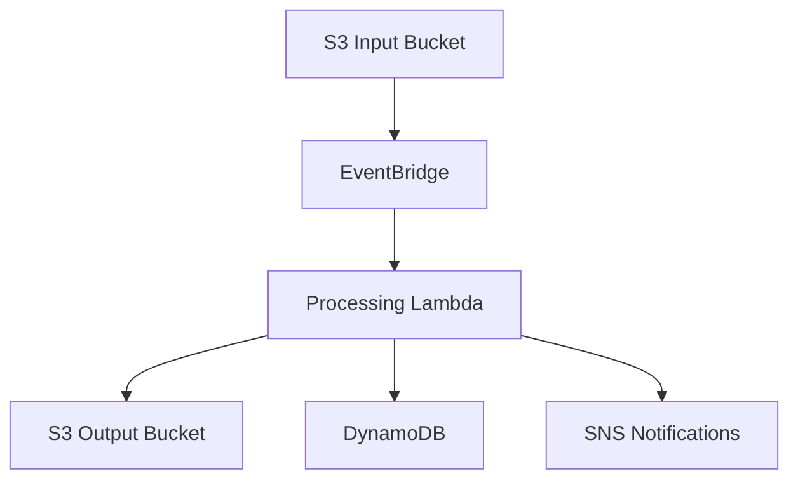

# Architecture

> This document describes the planned architecture. Components will be implemented incrementally.

## Event-Driven Sleep Audio Pipeline

This project implements an event-driven sleep audio processing pipeline using AWS CDK in Go.

Users upload sleep audio recordings to an S3 bucket. S3 emits events to EventBridge. An EventBridge rule matches upload events and triggers a Lambda function for audio processing. Processing results (metadata, analysis) are stored in DynamoDB. Processed audio artifacts are stored in a separate S3 output bucket. SNS sends notifications on processing completion or failure.

## Data Flow

