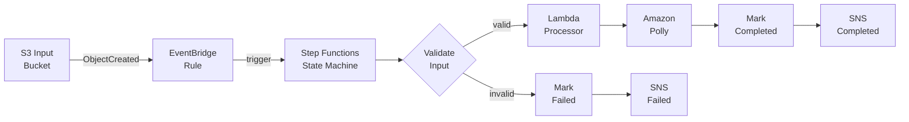
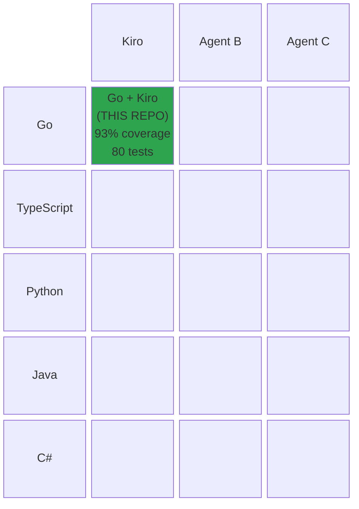
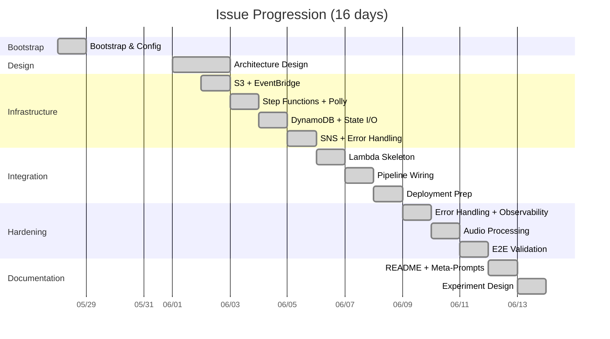

# Event-Driven Sleep Audio Pipeline

[](https://github.com/obstreperous-ai/cdk-sleep-go-kiro/actions/workflows/ci.yml)
[](https://go.dev/)
[](https://docs.aws.amazon.com/cdk/v2/guide/home.html)
[](https://github.com/obstreperous-ai/cdk-sleep-go-kiro/actions/workflows/ci.yml)
[](https://github.com/obstreperous-ai/cdk-sleep-go-kiro/actions/workflows/ci.yml)
[](https://github.com/obstreperous-ai/cdk-sleep-go-kiro/issues?q=is%3Aissue+is%3Aclosed)
[](./LICENSE)

A serverless AWS-native pipeline that accepts raw audio uploads and transforms them into polished sleep audio artifacts using Amazon Polly for text-to-speech synthesis. Built with AWS CDK in Go, the system is fully event-driven with no polling, no always-on compute, and no manual orchestration.

> **This is an experiment, not just a project.** You are looking at one cell in a 5-language x 3-AI-assistant experimental matrix exploring whether AI agents can build production-grade infrastructure from scratch using strict TDD. Everything here was built by an AI (Kiro) following issue-driven development with no human-written implementation code. Explore the code, examine the tests, read the methodology, and draw your own conclusions about what AI-driven development can (and cannot) produce today.

This project is also an **experiment in TDD-driven Infrastructure as Code** developed entirely through issue-driven development with AI agents. See [Experiment Methodology](#experiment-methodology) and [META-PROMPTS.md](./META-PROMPTS.md) for the reusable patterns extracted from this process.

---

## Table of Contents

- [Architecture Overview](#architecture-overview)
- [Quick Start](#quick-start)
- [Testing](#testing)
- [CI/CD](#cicd)
- [Experiment Methodology](#experiment-methodology)
- [Self-Grading](#self-grading)
- [Draw Your Own Conclusions](#draw-your-own-conclusions)
- [Visualizations](#visualizations)
- [Experiment Design](#experiment-design)
- [Meta-Prompting Patterns](#meta-prompting-patterns)
- [Project Structure](#project-structure)
- [Environment Configuration](#environment-configuration)
- [AWS Resources Created](#aws-resources-created)
- [Useful Commands](#useful-commands)
- [License](#license)
- [Contributing](#contributing)

---

## Architecture Overview

The pipeline follows four logical phases:

1. **Ingestion** - User uploads a raw audio file to the S3 input bucket
2. **Orchestration** - EventBridge detects the upload and triggers a Step Functions state machine
3. **Processing** - The state machine coordinates validation, Lambda processing, and Polly synthesis
4. **Delivery** - Processed audio is saved to S3; metadata lands in DynamoDB; SNS emits notifications



### Key Design Decisions

| Decision | Rationale |
|---|---|
| Serverless-only | Zero idle cost, automatic scaling, minimal operational overhead |
| Event-driven (EventBridge) | Decouples ingestion from processing; native S3 integration |
| Step Functions Express | Built-in retry/catch, visual debugging, cost-effective for short jobs |
| Go for CDK + Lambda | Type safety, fast cold starts, single language for infra and app code |
| Defense-in-depth validation | Fast-fail at orchestration layer; secondary validation in Lambda |

For the full architecture documentation including detailed Mermaid diagrams, error handling strategy, retry policies, and security design, see [ARCHITECTURE.md](./ARCHITECTURE.md).

---

## Quick Start

### Prerequisites

| Tool | Version | Purpose |
|---|---|---|
| Go | 1.25+ | CDK app and Lambda processor |
| Node.js | 22+ | AWS CDK CLI runtime |
| AWS CDK CLI | latest | `npm install -g aws-cdk` |
| AWS CLI | v2 | Account configuration and credential management |

### Clone and Install

```bash
git clone https://github.com/obstreperous-ai/cdk-sleep-go-kiro.git
cd cdk-sleep-go-kiro

# Download Go modules (root CDK app)
go mod download

# Download Go modules (Lambda processor)
cd lambda/processor && go mod download && cd ../..

# Install CDK CLI if not already installed
npm install -g aws-cdk
```

### Verify Setup

```bash
# Run all tests
go test -v -count=1 ./...

# Synthesize CloudFormation
cdk synth
```

### Deploy

```bash
# Deploy to dev (default)
cdk deploy

# Deploy to a specific environment
cdk deploy -c env=prod
```

---

## Testing

The project uses a multi-layered testing strategy following strict TDD principles. Every feature starts with a failing test before any implementation code is written.

### Test Layers

| Layer | File(s) | What It Tests |
|---|---|---|
| CDK assertions | `cdk-base_test.go` | Infrastructure resources exist with correct properties |
| IAM permissions | `cdk-base_test.go` | Least-privilege policies are scoped correctly |
| E2E validation | `cdk-base_test.go` | Full pipeline wiring from S3 event through to SNS notification |
| Snapshot stability | `cdk-base_test.go` | Golden file comparison prevents unintended infrastructure drift |
| Lambda unit tests | `lambda/processor/main_test.go` | Handler logic, validation, error handling with mocked AWS services |
| Lambda integration | `lambda/processor/main_test.go` | End-to-end processor flow and retry behavior |
| Pipeline tests | `pipeline_test.go` | CDK Pipeline stack synthesizes correctly |

### Running Tests

```bash
# All tests (recommended)
go test -v -count=1 ./...

# CDK infrastructure tests only
go test -v -count=1 -run TestStack ./

# Lambda processor tests only
go test -v -count=1 ./lambda/processor/

# Specific test
go test -v -count=1 -run TestEndToEndPipelineValidation ./
```

### Snapshot Regeneration

The snapshot test (`TestStackSnapshotStability`) compares the synthesized CloudFormation template against a golden file at `testdata/snapshot.json`. When you intentionally change infrastructure:

```bash
rm testdata/snapshot.json
go test -v -count=1 -run TestStackSnapshotStability ./
# Review the regenerated snapshot, then commit it alongside your changes
```

### Mock Pattern (Lambda Tests)

Lambda tests use interface-based mocks for AWS SDK clients:

```go
type mockS3Client struct {
    GetObjectFunc func(ctx context.Context, params *s3.GetObjectInput, ...) (*s3.GetObjectOutput, error)
    PutObjectFunc func(ctx context.Context, params *s3.PutObjectInput, ...) (*s3.PutObjectOutput, error)
}
```

When adding new AWS service interactions, define a new interface and corresponding mock struct following this pattern.

---

## CI/CD

### GitHub Actions

The project includes a GitHub Actions workflow ([`.github/workflows/ci.yml`](./.github/workflows/ci.yml)) that runs on every push and pull request to `main`:

1. Sets up Go (version from `go.mod`) and Node.js 22
2. Installs the AWS CDK CLI
3. Downloads Go modules for both root and Lambda
4. Runs `go test -v ./...`
5. Runs `cdk synth` to validate the CloudFormation template

### CDK Pipelines

A CDK Pipelines skeleton (`pipeline.go`) provides a self-mutating CI/CD pipeline using AWS CodePipeline. It is conditionally instantiated when `pipeline=true` context is set:

- Fetches source from GitHub via CodeStar Connections
- Runs `go test ./...` and `npx cdk synth` in the synth step
- Deploys the application stack automatically

```bash
cdk synth -c pipeline=true
```

---

## Experiment Methodology

This project serves as a **controlled experiment** in building production-grade Infrastructure as Code using strict TDD, issue-driven development, and AI agents as the primary development driver.

For the complete experiment design document covering the multi-language, multi-AI experimental setup, see [EXPERIMENT.md](./EXPERIMENT.md).

### Strict TDD Rules

Every change follows the red-green-refactor cycle at every layer:

1. **Write a failing test** - Define the expected behavior before writing any implementation
2. **Implement minimal code** - Write just enough to make the test pass
3. **Refactor** - Clean up while keeping tests green
4. **Repeat** - Each new feature starts with a new failing test

TDD is applied across all layers: CDK assertion tests for infrastructure, interface-based mocks for Lambda logic, E2E validation tests for cross-resource wiring, and snapshot tests for regression prevention.

### Issue-Driven Development

Every change begins as a tracked issue with a defined scope:

- No work happens without a corresponding issue
- Each issue maps to a focused, reviewable pull request
- Scope creep is explicitly prevented (one concern per issue)
- Issues create an audit trail of design decisions

### AI Agent Workflow

AI agents are the primary developers, guided by a structured persona prompt (see [`.github/AGENT_GUIDELINES.md`](./.github/AGENT_GUIDELINES.md)):

- The agent operates as a "Senior AWS CDK Go TDD Specialist"
- Must follow strict TDD (failing tests first, then minimal code)
- Must keep `ARCHITECTURE.md` in sync with every infrastructure change
- Must prefer L2/L3 CDK constructs and follow AWS Well-Architected principles
- Must never deploy until tests and synth succeed locally

### Key Findings

| Finding | Impact |
|---|---|
| Snapshot tests catch unintended drift during refactoring | High confidence in infrastructure stability |
| Interface-based mocks enable rapid Lambda iteration without AWS credentials | Faster TDD cycles, no cloud dependency |
| Dual-validation (Step Functions + Lambda) provides defense-in-depth | Cheaper fast-fail + comprehensive secondary checks |
| Separate Go modules for Lambda isolate SDK dependencies | Smaller deployment artifacts, cleaner dependency graphs |
| CDK feature flags affect IAM policy structure | Tests must account for flag-dependent behavior |

For the full summary of lessons learned, trade-offs, and experiment notes, see [SUMMARY.md](./SUMMARY.md).

### Self-Grading

This instance includes a self-evaluation scored against the original experiment goals defined in [EXPERIMENT.md](./EXPERIMENT.md). The AI agent graded its own output, providing one data point for how AI systems assess their own work.

| Goal | Score | Verdict |
|---|---|---|
| 1. Measure Feasibility | 8/10 | Demonstrated with caveats (no production deployment) |
| 2. Evaluate Quality | 7/10 | High quality code, but undeployed and untested under load |
| 3. Extract Patterns | 9/10 | 7 documented, reusable meta-prompting patterns |
| 4. Compare Across Dimensions | 4/10 | Single instance; comparison framework exists but no data yet |
| 5. Document Process | 9/10 | Comprehensive, reproducible methodology captured |
| **Average** | **7.4/10** | |

The full self-evaluation with detailed justification for each score is in [FINAL-REPORT.md](./FINAL-REPORT.md). Note that self-grading is inherently limited; external validation through deployment, cross-instance comparison, and independent code review remains necessary for definitive conclusions.

### Metrics at a Glance

| Metric | Value |
|---|---|
| Total lines of code | 6,092 |
| Test functions | 80 |
| Lambda processor coverage | 93.3% |
| Documentation lines | ~2,200 |
| Issues closed | 14/14 |
| PRs merged | 14 |
| Average cycle time | ~1 day/issue |
| AWS resources defined | 10+ |
| Meta-prompting patterns | 7 |

### Draw Your Own Conclusions

This project is **one data point** in a broader experiment, not a definitive answer. Consider these questions as you explore:

- Does strict TDD produce better infrastructure when the developer is an AI?
- Is the code quality comparable to what a senior engineer would write?
- Are there failure modes that tests miss because the same AI wrote both code and tests?
- Would a different language or AI agent make meaningfully different architectural choices?
- Does the self-grading score (7.4/10) seem fair, generous, or harsh to you?

The experiment is designed so that readers, other developers, and future researchers can evaluate the output independently. All source code, tests, documentation, commit history, and issue threads are public. The methodology is documented in [EXPERIMENT.md](./EXPERIMENT.md) and the patterns are reusable via [META-PROMPTS.md](./META-PROMPTS.md).

We invite you to clone this repo, read the tests, compare with your own work, and form your own assessment.

---

## Visualizations

### Experiment Matrix

This project occupies one cell in the experimental matrix. The highlighted cell shows this instance:



### Development Timeline

The project progressed through 14 issues over 16 days with consistent velocity:



For the full architecture diagrams including system topology, current state, error handling flows, and the TDD development workflow, see [ARCHITECTURE.md](./ARCHITECTURE.md).

---

## Experiment Design

This project is one instance in a **5 languages x 3 AI assistants** experimental matrix. All instances build the same conceptual pipeline, enabling direct comparison of how different language-AI combinations handle identical requirements.

| Dimension | This Instance |
|---|---|
| Language | Go 1.25 (CDK + Lambda) |
| AI Agent | Kiro (by Amazon) |
| Duration | 16 days, 14 issues, 13 PRs |
| Methodology | Strict TDD + issue-driven development |

For the full experiment design document including methodology, actors, prompting strategy, issue history, and preliminary observations, see [EXPERIMENT.md](./EXPERIMENT.md).

---

## Meta-Prompting Patterns

This project demonstrates several reusable **meta-prompting patterns** for AI-driven infrastructure development. These patterns can be extracted and adapted for any CDK, Terraform, or IaC project using AI agents.

The patterns include:

- **Agent Persona Pattern** - Define a specialist identity with explicit constraints
- **TDD-First Pattern** - Enforce red-green-refactor at every layer
- **Architecture-as-Source-of-Truth Pattern** - Keep documentation as the living design authority
- **Issue-Driven Development Pattern** - Scope every change to a tracked issue
- **Conventional Commits Pattern** - Structured commit messages for automated tooling
- **Snapshot Stability Pattern** - Golden file comparison for drift detection
- **Defense-in-Depth Validation Pattern** - Validate at multiple layers

For full pattern descriptions, templates, and guidance on adapting them to new projects, see [META-PROMPTS.md](./META-PROMPTS.md).

---

## Project Structure

```
cdk-sleep-go-kiro/
  cdk-base.go              # Main CDK stack (infrastructure definition)
  cdk-base_test.go         # CDK assertion tests + E2E validation tests
  pipeline.go              # CDK Pipelines CI/CD stack
  pipeline_test.go         # Pipeline stack tests
  cdk.json                 # CDK app configuration and feature flags
  go.mod                   # Root Go module (CDK dependencies)
  lambda/
    processor/
      main.go              # Lambda handler (audio processing)
      main_test.go         # Lambda unit tests with mocks
      go.mod               # Lambda Go module (AWS SDK dependencies)
  .github/
    workflows/
      ci.yml               # GitHub Actions CI workflow
    AGENT_GUIDELINES.md    # AI agent persona and rules
  testdata/
    snapshot.json          # CDK snapshot golden file (auto-generated)
  ARCHITECTURE.md          # Detailed architecture documentation
  CONTRIBUTING.md          # Contribution guidelines and dev setup
  SUMMARY.md              # Project summary and key decisions
  META-PROMPTS.md          # Reusable meta-prompting patterns
  LICENSE                  # Apache License 2.0
```

---

## Environment Configuration

The CDK app supports multiple environments via context variables. Stack names follow the pattern `SleepAudioPipeline-{env}`, ensuring separate CloudFormation stacks per environment.

| Context Variable | Default | Description |
|---|---|---|
| `env` | `dev` | Target environment (dev/staging/prod) |
| `pipeline` | `false` | Enable CDK Pipelines CI/CD stack |

### Usage Examples

```bash
# Default development environment
cdk synth

# Production environment
cdk synth -c env=prod

# Enable the CI/CD pipeline stack
cdk synth -c pipeline=true
```

### Environment Variables

When running locally, you may need to set these environment variables:

```bash
# Avoid Node.js proxy-bootstrap issues in sandboxed environments
export NODE_OPTIONS=''

# Ensure Go modules resolve correctly
export GOPROXY=https://proxy.golang.org,direct
```

---

## AWS Resources Created

When deployed, this stack creates:

| Resource | Configuration |
|---|---|
| **S3 Input Bucket** | Encrypted (AES256), versioned, EventBridge enabled, block public access |
| **S3 Output Bucket** | Encrypted (AES256), versioned, block public access |
| **EventBridge Rule** | Matches S3 ObjectCreated events, triggers Step Functions |
| **Step Functions State Machine** | Express Workflow, X-Ray tracing, CloudWatch logging at ALL level |
| **Lambda Function** | Go custom runtime (`provided.al2023`), structured JSON logging |
| **DynamoDB Table** | On-demand billing, point-in-time recovery, AWS-managed encryption |
| **SNS Topics** | Completion + Failure notifications, KMS encrypted |
| **CloudWatch Log Group** | State machine execution logs |
| **CloudWatch Alarms** | ExecutionsFailed and Lambda Errors monitoring |

---

## Useful Commands

| Command | Description |
|---|---|
| `go test -v ./...` | Run all unit tests |
| `cdk synth` | Synthesize CloudFormation template |
| `cdk deploy` | Deploy stack to AWS |
| `cdk diff` | Compare local changes with deployed stack |
| `cdk destroy` | Tear down the deployed stack |
| `cdk synth -c env=prod` | Synth for production environment |
| `cdk synth -c pipeline=true` | Synth with CI/CD pipeline |

---

## License

This project is licensed under the Apache License 2.0. See [LICENSE](./LICENSE) for details.

---

## Contributing

Contributions are welcome. Please read [CONTRIBUTING.md](./CONTRIBUTING.md) for development environment setup, testing strategy, code structure, and commit conventions.

Key guidelines:

- Follow strict TDD (failing tests first)
- Use [Conventional Commits](https://www.conventionalcommits.org/) format
- Keep [ARCHITECTURE.md](./ARCHITECTURE.md) in sync with any infrastructure changes
- Run `go test -v -count=1 ./...` and `cdk synth` before pushing
