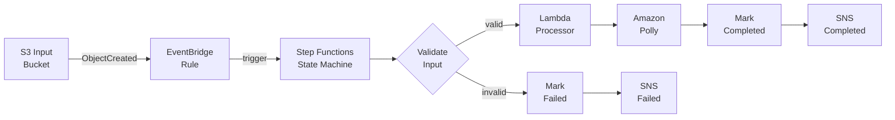

# Event-Driven Sleep Audio Pipeline

A serverless AWS-native pipeline that accepts raw audio uploads and transforms them into polished sleep audio artifacts using Amazon Polly for text-to-speech synthesis. Built with AWS CDK in Go, the system is fully event-driven with no polling, no always-on compute, and no manual orchestration.

## Architecture Overview

The pipeline follows four logical phases:

1. **Ingestion** - User uploads a raw audio file to the S3 input bucket
2. **Orchestration** - EventBridge detects the upload and triggers a Step Functions state machine
3. **Processing** - The state machine coordinates validation, Lambda processing, and Polly synthesis
4. **Delivery** - Processed audio is saved to S3; metadata lands in DynamoDB; SNS emits notifications



For the full architecture documentation including Mermaid diagrams, error handling strategy, retry policies, and security design, see [ARCHITECTURE.md](./ARCHITECTURE.md).

## Prerequisites

- **Go** 1.25 or later
- **Node.js** 22 or later (required for CDK CLI)
- **AWS CDK CLI** (`npm install -g aws-cdk`)
- **AWS Account** with credentials configured (`aws configure`)

## Getting Started

### Clone and install dependencies

```bash
git clone https://github.com/obstreperous-ai/cdk-sleep-go-kiro.git
cd cdk-sleep-go-kiro

# Download Go modules (root CDK app)
go mod download

# Download Go modules (Lambda processor)
cd lambda/processor && go mod download && cd ../..

# Install CDK CLI if not already installed
npm install -g aws-cdk
```

### Run tests

```bash
go test -v -count=1 ./...
```

### Synthesize CloudFormation

```bash
cdk synth
```

### Deploy to AWS

```bash
# Deploy to dev (default)
cdk deploy

# Deploy to a specific environment
cdk deploy -c env=prod
```

## Environment Configuration

The CDK app supports multiple environments via context variables. Stack names follow the pattern `SleepAudioPipeline-{env}`, ensuring separate CloudFormation stacks per environment.

| Context Variable | Default | Description |
|---|---|---|
| `env` | `dev` | Target environment (dev/staging/prod) |
| `pipeline` | `false` | Enable CDK Pipelines CI/CD stack |

### Usage examples

```bash
# Default development environment
cdk synth

# Production environment
cdk synth -c env=prod

# Enable the CI/CD pipeline stack
cdk synth -c pipeline=true
```

## CI/CD

### GitHub Actions

The project includes a GitHub Actions workflow (`.github/workflows/ci.yml`) that runs on every push and pull request to `main`:

1. Sets up Go (version from `go.mod`) and Node.js 22
2. Installs the AWS CDK CLI
3. Downloads Go modules
4. Runs `go test -v ./...`
5. Runs `cdk synth` to validate the CloudFormation template

### CDK Pipelines

A CDK Pipelines skeleton (`pipeline.go`) provides a self-mutating CI/CD pipeline using AWS CodePipeline. It is conditionally instantiated when `pipeline=true` context is set. The pipeline:

- Fetches source from GitHub via CodeStar Connections
- Runs `go test ./...` and `npx cdk synth` in the synth step
- Deploys the application stack

## Project Structure

```
cdk-sleep-go-kiro/
  cdk-base.go              # Main CDK stack (infrastructure definition)
  cdk-base_test.go         # CDK assertion tests + E2E validation tests
  pipeline.go              # CDK Pipelines CI/CD stack
  pipeline_test.go         # Pipeline stack tests
  cdk.json                 # CDK app configuration and feature flags
  go.mod                   # Root Go module (CDK dependencies)
  lambda/
    processor/
      main.go              # Lambda handler (audio processing)
      main_test.go         # Lambda unit tests with mocks
      go.mod               # Lambda Go module (AWS SDK dependencies)
  .github/
    workflows/
      ci.yml               # GitHub Actions CI workflow
  testdata/
    snapshot.json          # CDK snapshot golden file (auto-generated)
  ARCHITECTURE.md          # Detailed architecture documentation
  CONTRIBUTING.md          # Contribution guidelines
  SUMMARY.md               # Project summary and key decisions
```

## Testing

The project uses a multi-layered testing strategy:

### CDK Infrastructure Tests (`cdk-base_test.go`)

- **Resource assertion tests** - Verify that specific AWS resources exist with correct configurations (S3 buckets, DynamoDB table, Lambda function, EventBridge rule, Step Functions state machine, SNS topics, CloudWatch alarms)
- **IAM permission tests** - Verify least-privilege policies are correctly scoped
- **End-to-end validation tests** - Validate the full pipeline flow: S3 event triggers EventBridge, EventBridge targets Step Functions, state machine chains all states correctly for success and failure paths
- **Snapshot test** - Golden file comparison ensuring infrastructure stability across changes

### Lambda Unit Tests (`lambda/processor/main_test.go`)

- **Input validation tests** - Missing fields, invalid extensions
- **Happy path tests** - Full processing flow with mocked AWS services (S3, Polly, DynamoDB)
- **Error handling tests** - S3 download failures, Polly errors, DynamoDB errors
- **End-to-end integration tests** - Complete processor pipeline flow validation
- **Retry behavior tests** - Transient failure recovery compatible with Step Functions retry configuration

### Pipeline Tests (`pipeline_test.go`)

- Verify the CDK Pipeline stack synthesizes correctly with CodePipeline resources

### Running tests

```bash
# Run all tests (recommended)
go test -v -count=1 ./...

# Run only CDK infrastructure tests
go test -v -count=1 -run TestStack ./

# Run only Lambda tests
go test -v -count=1 ./lambda/processor/

# Run a specific test
go test -v -count=1 -run TestEndToEndPipelineValidation ./
```

### Snapshot regeneration

If infrastructure changes cause the snapshot test to fail, delete and regenerate:

```bash
rm testdata/snapshot.json
go test -v -count=1 -run TestStackSnapshotStability ./
```

## Useful Commands

| Command | Description |
|---|---|
| `go test -v ./...` | Run all unit tests |
| `cdk synth` | Synthesize CloudFormation template |
| `cdk deploy` | Deploy stack to AWS |
| `cdk diff` | Compare local changes with deployed stack |
| `cdk destroy` | Tear down the deployed stack |
| `cdk synth -c env=prod` | Synth for production environment |
| `cdk synth -c pipeline=true` | Synth with CI/CD pipeline |

## AWS Resources Created

When deployed, this stack creates:

- **S3 Input Bucket** - Receives raw audio uploads (encrypted, versioned, EventBridge enabled)
- **S3 Output Bucket** - Stores processed audio (encrypted, versioned)
- **EventBridge Rule** - Matches S3 ObjectCreated events, triggers Step Functions
- **Step Functions State Machine** - Orchestrates the full pipeline (Express Workflow, X-Ray tracing)
- **Lambda Function** - Go custom runtime processor (validates, downloads, processes, uploads)
- **DynamoDB Table** - Metadata tracking (on-demand billing, point-in-time recovery)
- **SNS Topics** - Completion and failure notifications (KMS encrypted)
- **CloudWatch Log Group** - State machine execution logs
- **CloudWatch Alarms** - ExecutionsFailed and Lambda Errors monitoring

## License

See [LICENSE](./LICENSE) for details.
